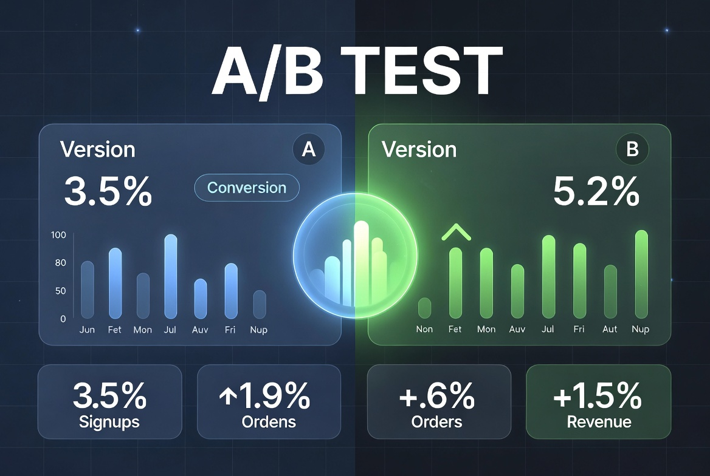

<div align="center">
  
</div>

# <center> **PROJECT: Marketplace A/A/B Testing Analysis**

Comprehensive statistical analysis of A/A/B experiment results for a large e-commerce marketplace.

---

### **Project Goal**

Validate the correctness of traffic splitting (A/A test) and evaluate whether the new algorithm (group B) improves key business metrics: CTR, Purchase Rate, and GMV.

---

### **Dataset**

- Three groups: `sample_a`, `sample_c` (A/A), `sample_b` (B)
- User actions: Click (0), View (1), Purchase (2)
- Metrics: CTR, Purchase Rate, GMV (per session)

---

### **Project Stages**

1. Basic data analysis and familiarization
2. Data cleaning and validation
3. Metric calculation
4. A/A test (validation of splitting)
5. A/B test analysis
6. Final conclusions and recommendations

---

### **Key Findings**

**A/A Test (sample_a vs sample_c):**

- Statistically significant differences found in all metrics (`p-value = 0.0`)
- CTR: 20% vs 21%
- Purchase Rate: 5% vs 6%
- GMV: 53,273 vs 63,999

**Conclusion**: Serious issues with traffic splitting were detected. A and C groups, which should be identical, show significant differences. Therefore, the results of the A/B test (A vs B) are **unreliable**.

---

### **Technologies Used**

- `pandas`, `numpy`, `scipy`
- `statsmodels`
- `matplotlib`, `seaborn`, `plotly`
- Statistical tests (Shapiro-Wilk, proportion test, t-test)

---

### **Project Structure**

- `notebooks/` — main analysis notebook
- `data/` — raw datasets
- `figures/` — visualizations and metric plots
- `requirements.txt`

---

### **Final Conclusion**

The A/A test revealed critical problems with the splitting system. Due to significant differences between control groups, the results of the A/B test cannot be trusted. It is recommended to fix the traffic allocation mechanism before running further experiments.

---

### **How to run**

```bash
cd Applied-ML.AAB-Testing-Marketplace-Experiment

pip install -r requirements.txt

jupyter notebook "PROJECT - Applied ML. AAB Testing Analysis - Marketplace Experiment.ipynb"